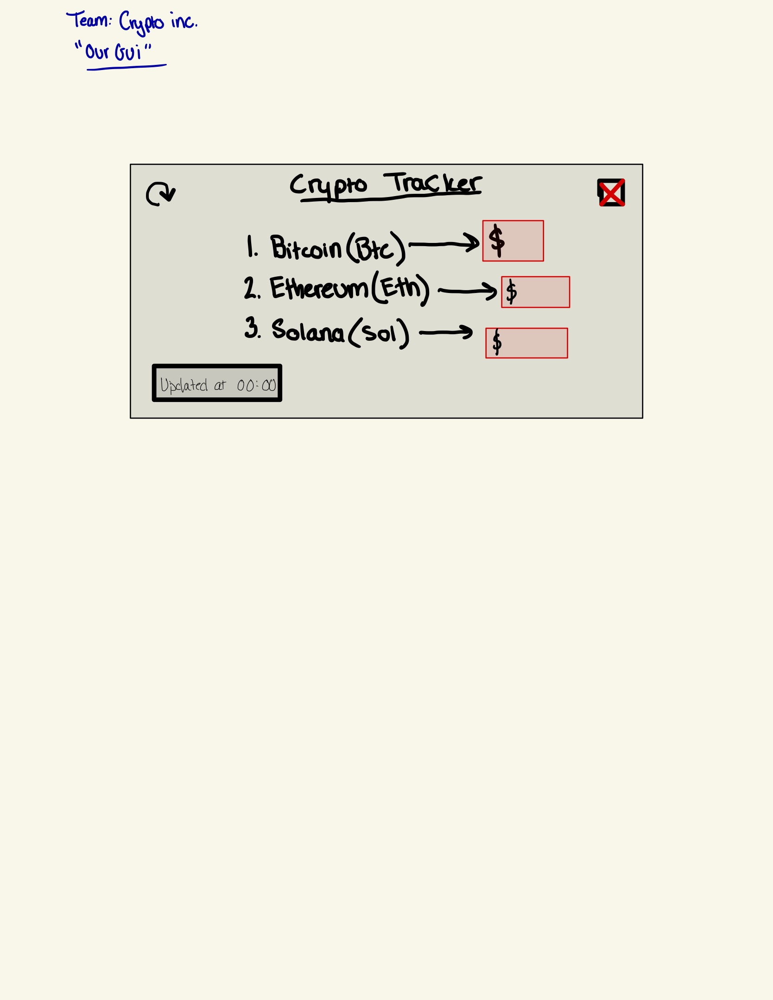

:warning: Everything between << >> needs to be replaced (remove << >> after replacing)

# << Project Title >>
## CS110 Final Project  << Semester, Year >>

## Team Members

 Kamish Charniya and Walter Silbert 

***

## Project Description

 This project will incorporate crypto prices in real time and allow the user to use a button to update the prices in real time. We will possibly use rest API's from cryptocurreny sites that display real time price like Coinbase or Blockchain.com.

***    

## GUI Design

### Initial Design

### Final Design

## Program Design

### Features

1. GUI usage
2. Button usage
3. Image usage
4. Pygame usage
5. << Feature 5 >>

### Classes

- << You should have a list of each of your classes with a description >>
CryptoCurrency:

Represents a cryptocurrency entity, storing information such as name, symbol, price, market capitalization, and 24-hour trading volume.
Methods include update_price, get_market_cap, and get_volume_24h for modifying and accessing specific data attributes of a cryptocurrency.

CryptoTracker:

Manages a list of CryptoCurrency instances, initializes them, and fetches cryptocurrency prices from an API.
Controls the tkinter-based display, updating it with fetched cryptocurrency information at regular intervals.
Includes methods like initialize_currencies, fetch_crypto_prices, create_display, update_display, and continuous_update_and_display.

CryptoTrackerController:

Acts as a higher-level controller managing the interaction between the CryptoTracker and the tkinter display.
Initializes a tkinter window and the CryptoTracker, starting the continuous display updates.

All of these are our separate classes at the moment from whihc our project is made upon.
## ATP
Test 1:  Ticker Price
Test description: Make sure that the ticker price is displayed after start of program
Test Step:  1- Run the program
            2- Allow the window to open 
            3-Make sure there is a price of stock displayed
Expected outcome: A price is shown in correspondence with the stock its next to

Test 2:  Stocks
Test description: Make sure that the Stocks are displayed after start of program
Test Step:  1- Run the program
            2- Allow the window to open 
            3-Make sure the stocks are displayed
Expected outcome: All Stocks are shown for the user to view

Test 3:  Market Cap evaluation
Test description: Make sure that the market cap for each stock is displayed after start of program
Test Step:  1- Run the program
            2- Allow the window to open 
            3-Make sure there is a market cap amount displayed
Expected outcome: A market cap ammount is shown in correspondence with the stock its next to

Test 4:  Stock Voulme
Test description: Make sure that the stock volume is displayed after start of program
Test Step:  1- Run the program
            2- Allow the window to open 
            3-Make sure there is a stock volume for 24 hours displayed
Expected outcome: A stock volume is shown in correspondence with the stock its next to

Test 5:  Price Update
Test description: Make sure that the price for each stock updates each minute the program window is open
Test Step:  1- Run the program
            2- Allow the window to open 
            3-Make sure after a minute has elapsed the price for each stock updates
Expected outcome: Stock price updates every minute as long as the window is open